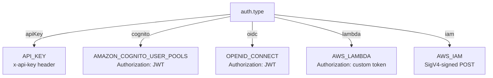

# Auth modes

AppSync supports five authorization modes. `aws-appsync-js` supports all of them through one discriminated `auth` field — change the `type` and TypeScript narrows the rest:



## Side-by-side

| Mode               | `auth.type` | What you supply                          | Typical use case                                | Edge-safe? |
| ------------------ | ----------- | ---------------------------------------- | ----------------------------------------------- | ---------- |
| API Key            | `apiKey`    | Static key string                        | Public / semi-public APIs, demos, prototypes    | ✅          |
| Cognito User Pools | `cognito`   | JWT (string or function)                 | End-user-facing apps with Cognito sign-in       | ✅          |
| OIDC               | `oidc`      | JWT (string or function)                 | Auth0, Okta, Keycloak, any OpenID Connect IdP   | ✅          |
| Lambda authorizer  | `lambda`    | Opaque token (string or function)        | Custom auth (audit IDs, partner tokens, …)      | ✅          |
| AWS IAM (SigV4)    | `iam`       | `region` + AWS credentials               | Service-to-service from your AWS environment    | ⚠️ Node only |

## Tokens can be functions

For any auth mode where the credential isn't a static API key, the token can be a **function** (sync or async). The client calls it per request, which makes silent refresh, IMDS lookups, and step-up auth trivial:

```ts
new AppSyncClient({
  url,
  auth: {
    type: 'cognito',
    jwtToken: async () => (await refreshIfExpired()).idToken,
  },
});
```

## Type-safe by construction

The auth config is a [discriminated union](https://www.typescriptlang.org/docs/handbook/2/narrowing.html#discriminated-unions). Bad combos won't compile:

```ts
new AppSyncClient({
  url,
  auth: {
    type: 'iam',
    // This will error: Property 'region' is missing
    // This will error: Property 'credentials' is missing
  },
});
```

```ts
new AppSyncClient({
  url,
  auth: {
    type: 'apiKey',
    // This will error: 'jwtToken' does not exist on { type: 'apiKey', apiKey: string }
    jwtToken: getToken,
  },
});
```

## Quick links

- [API key](/docs/auth-modes/api-key) — easiest, public-ish.
- [Cognito User Pools](/docs/auth-modes/cognito) — most common in user-facing apps.
- [OIDC](/docs/auth-modes/oidc) — same shape, different IdP.
- [Lambda authorizer](/docs/auth-modes/lambda) — your function decides.
- [AWS IAM (SigV4)](/docs/auth-modes/iam) — service-to-service from your AWS environment.
